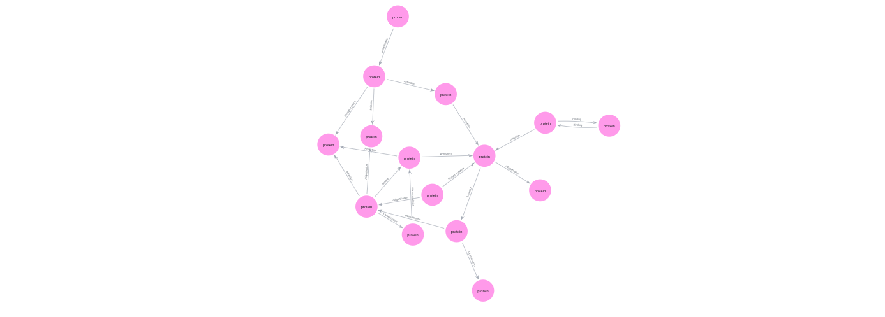

# BioCypher Python code adapter, synthetic protein data


[](https://github.com/iulusoy/python-ui-adapter/actions/workflows/ci.yaml)


This repository contains the code for the Python UI pathway, to create a knowledge graph from a tabular protein interaction dataset using [BioCypher](https://biocypher.org/) and Python code. The following files and folders can be found in this repo:

- a synthetic input dataset (`data/in/synthetic_protein_interactions.tsv`)
- a BioCypher schema (`config/schema_config.yaml`)
- a BioCypher runtime config (`config/biocypher_config.yaml`)
- Python code to prepare the nodes and edges tuples for BioCypher (`src/adapters/adapter_syntehtic_proteins.py`)

The `data` folder is thus responsible for holding the input data (the dataset can also be pulled from the web on-the-fly, but for convenience we have included it here). The `config` folder contains all configuration files. Upon running `create_knowledge_graph.py`, the directories `biocypher-log` and `biocypher-out` are created that contain logging information and output files, respectively.

## Knowledge graph architecture

The KG that is build from the raw data contains the following node and edge types, in accordance with the [`BIOLINK` ontology](https://bioportal.bioontology.org/ontologies/BIOLINK)

**Node types**:
- `protein` (base node)
The node labels are inferred from the `source` and `target` columns (uniprot id's). 

**Edge types**:
- `protein protein interaction` (base edge)
- `activation`
- `binding`
- `inhibition`
- `phosphorylation`
- `ubiquitination`

Edge-specific properties are derived from input columns such as `is_directed`, `is_stimulation`, and consensus flags.

## Source Data

The expected TSV columns in the source data are:
- `source`, `target`
- `source_genesymbol`, `target_genesymbol`
- `is_directed`, `is_stimulation`, `is_inhibition`
- `consensus_direction`, `consensus_stimulation`, `consensus_inhibition`
- `type`
- `ncbi_tax_id_source`, `entity_type_source`
- `ncbi_tax_id_target`, `entity_type_target`

The `type` column is matched (case-insensitive) to edge labels via regex in the mapping file. The final KG looks like this:


## Installation

Create a Python environment and install the package from `pyproject.toml` into your environment, ie.

```bash
conda create --name biocypher-adapter python=3.13
conda activate biocypher-adapter
pip install uv
uv pip install -e .
```

This will install all the necessary libraries for you.

## Build the knowledge graph

First, you need to update the `import_call_bin_prefix:` in `config/biocypher_config.yaml` to point to your Neo4j instance and database (for instructions, follow [the tutorial](https://biocypher.org/BioCypher/learn/tutorials/tutorial_basics_neo4j_offline/tutorial_004_neo4j_offline/)).

To then build the KG, run the following from the repository root:

```bash
python create_knowledge_graph.py 
```
After a successful run, BioCypher writes timestamped output directories under `biocypher-out/`, containing:

- node CSV header and part files (for example `Protein-header.csv`, `Protein-part000.csv`)
- edge CSV header and part files per relation type
- `neo4j-admin-import-call.sh` (generated import command script)

Runtime logs are written to `biocypher-log/`.

## Import the graph into Neo4j

Each generated output folder includes a ready-to-run script:

```bash
bash biocypher-out/<timestamp>/neo4j-admin-import-call.sh
```
Run this script while the Neo4j instance is stopped, to import the graph into your instance as specified in the `biocypher_config.yaml`.

## Configuration Notes

### BioCypher config (`config/biocypher_config.yaml`)

- points schema to `config/schema_config.yaml`
- sets delimiter and array delimiter for Neo4j CSV generation
- includes a configured `neo4j.import_call_bin_prefix` that each user has to set to their own Neo4j instance

### Schema config (`config/schema_config.yaml`)

- uses `input_label` fields to map OntoWeaver output labels to schema concepts
- defines base and inherited nodes/edges and sets edge properties

## Adapter and dataset metadata
The adapter and dataset metadata is contained in the [`croissant`](croissant.jsonld) file.

## BioCypher MCP-Informed Documentation

This README structure follows BioCypher MCP guidance for adapter documentation:

- clear data contract and schema mapping (`input_label` alignment)
- explicit execution and output workflow
- resource and import operational notes
- maintenance-friendly troubleshooting section

## Troubleshooting

- Command not found: ensure `ontoweave` is installed and on `PATH`.
- No output produced: check `biocypher-log/` for parsing or mapping errors.
- Unexpected edge labels: verify `type` values against regex rules in `config/protein_interactions_mapping.yaml`.
- Neo4j import warnings: inspect `neo4j-admin-import-call.sh` and confirm local Neo4j binary path in `config/biocypher_config.yaml`.

## License

MIT (see `LICENSE`).
